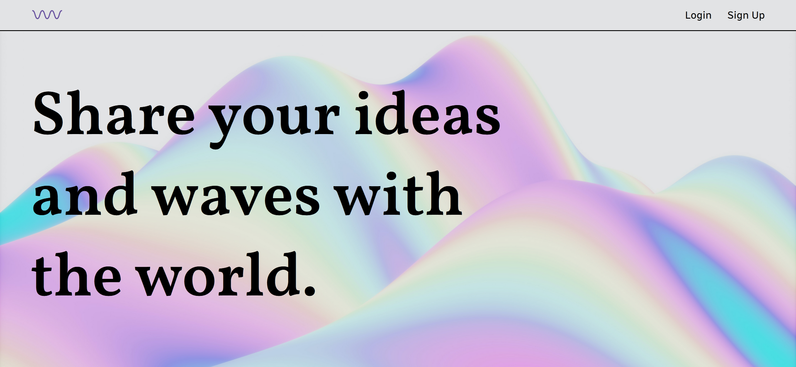
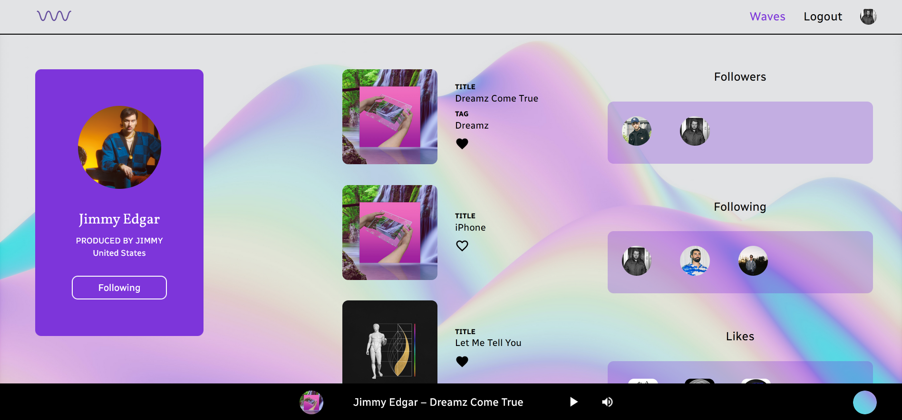

# waveland

A platform to upload, play and like sounds. Visit other user profiles and follow them - their newest tracks will appear in your *Stream*.\
Built with *React*, *Node.js*, *Express.js* and *MongoDB*.\
Enjoy the [waves](https://waveland.herokuapp.com/).

## Setup

Clone this repository.\
Create an .env-file with the following variables:
- MONGODB_URI
- JWT_SECRET
- CLOUDINARY_NAME
- CLOUDINARY_KEY
- CLOUDINARY_SECRET

Install the required npm-packages and start server and client:

```shell
$ npm install
$ npm start

$ cd client
$ npm install
$ npm start
```

Open [http://localhost:3000](http://localhost:3000) to visit *waveland*.



